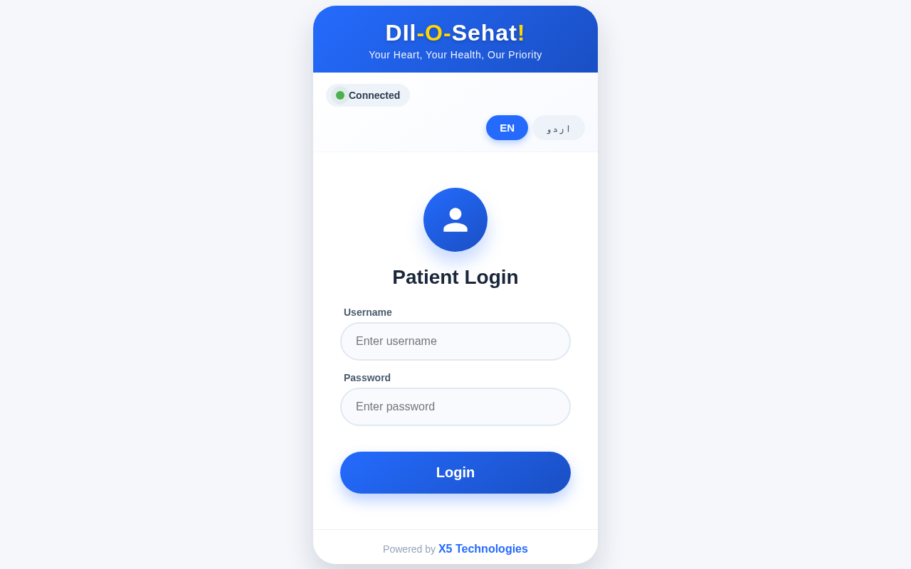
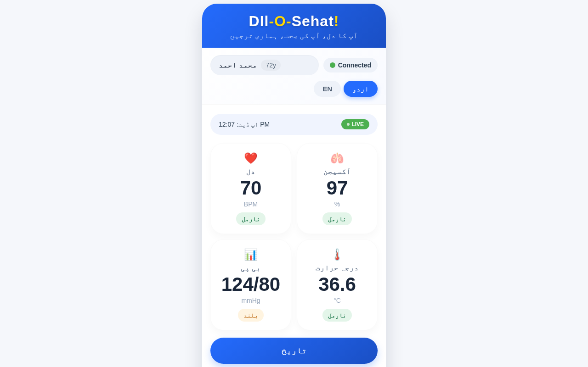
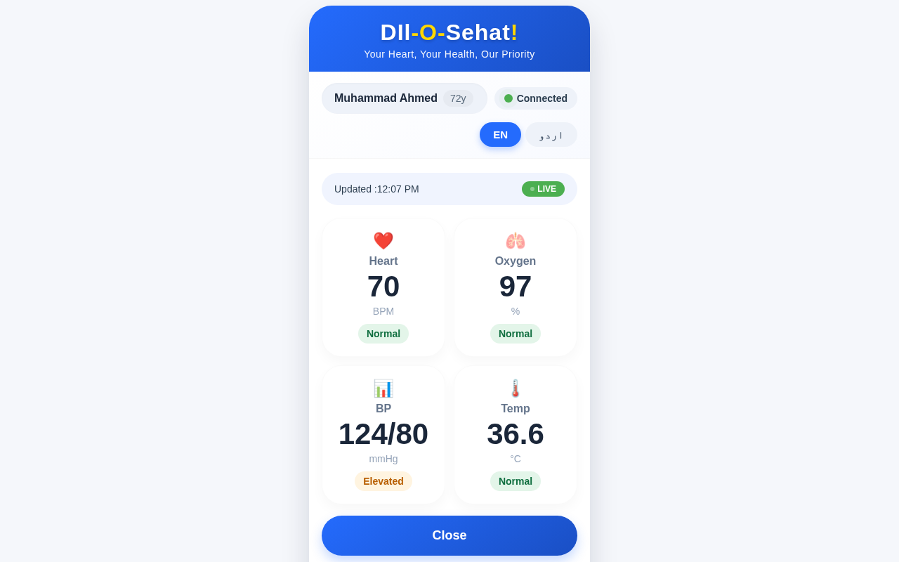
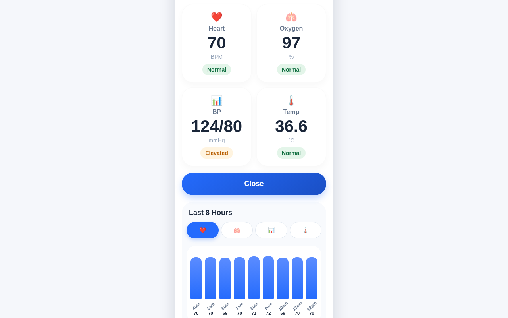

# Dil-O-Sehat! 

### **Your Heart, Your Health, Our Priority**
**آپ کا دل، آپ کی صحت، ہماری ترجیح**



---

## Project Overview

**Dil-O-Sehat** is a comprehensive multimodal physiological monitoring system designed specifically for elderly care in Pakistan. The project transforms everyday smartphones into powerful health-monitoring platforms through a compact DIY wearable device paired with a custom Android/Web application for seamless, real-time tracking of vital health parameters.

The system addresses Pakistan's escalating healthcare challenges from its rapidly aging population and overburdened medical infrastructure by providing continuous, objective home data instead of episodic telemedicine readings.

---

## Key Features

| Feature | Description |
|---------|-------------|
| **Real-time ECG/Heart Rate Monitoring** | Continuous heart rate tracking with live BPM display |
| **Pulse Oximetry (SpO2)** | Blood oxygen saturation monitoring |
| **Non-invasive Blood Pressure** | Systolic/Diastolic pressure measurement (mmHg) |
| **Body Temperature** | Accurate temperature readings in °C |
| **Bilingual Interface** | Full support for English and Urdu (اردو) |
| **Trend History** | 8-hour historical data visualization with charts |
| **Color-coded Health Alerts** | Traffic-light system (Normal/Elevated/Critical) |
| **Bluetooth Connectivity** | Wireless data streaming from wearable to smartphone |
| **Live Status Indicator** | Real-time connection and update status |

---

## Screenshots

### 1. Patient Login Screen
The secure login interface allows patients to access their personalized health dashboard.


**Features shown:**
- Clean, user-friendly login interface
- Language toggle (EN/اردو)
- Connection status indicator
- Powered by X5 Technologies

---

### 2. Real-time Dashboard (English)
The main dashboard displays all vital signs with real-time updates from the DIY wearable device.


**Features shown:**
- Patient profile with name and age (Muhammad Ahmed, 72y)
- Live connection status (Connected indicator)
- Last updated timestamp with LIVE badge
- **Heart Rate:** 72 BPM (Normal)
- **Oxygen Saturation:** 96% (Normal)
- **Blood Pressure:** 125/81 mmHg (Elevated - shown in orange)
- **Temperature:** 36.7°C (Normal)
- Color-coded status badges for quick health assessment

---

### 3. Dashboard in Urdu (اردو)
Full bilingual support for Urdu-speaking elderly users and caregivers with limited English proficiency.



**Urdu Labels:**
- دل (Heart)
- آکسیجن (Oxygen)
- بی پی (Blood Pressure)
- درجہ حرارت (Temperature)
- نارمل (Normal) / بلند (Elevated)
- تاریخ (History)

---

### 4. History View with Vital Signs
Access historical health data with expandable vital sign cards.



**Features shown:**
- Current vital readings summary
- Close button to return to dashboard
- Last 8 Hours trend section
- Tab navigation for different vital signs (Heart, Oxygen, BP, Temperature)

---

### 5. Historical Trends & Charts
Visual representation of health data over time using intuitive bar charts.



**Features shown:**
- Heart rate trend over last 8 hours (4am - 12pm)
- Individual hourly readings displayed below each bar
- Tab icons to switch between different vital sign histories
- Logout button for secure session termination

---

## System Architecture

```
┌─────────────────────────────────────────────────────────────────────────┐
│                         DIL-O-SEHAT SYSTEM ARCHITECTURE                  │
└─────────────────────────────────────────────────────────────────────────┘

┌──────────────────┐     ┌──────────────────┐     ┌──────────────────┐
│   WEARABLE       │     │   SMARTPHONE/    │     │   USER           │
│   DEVICE         │────▶│   WEB APP        │────▶│   INTERFACE      │
│                  │ BLE │                  │     │                  │
│  ┌────────────┐  │     │  ┌────────────┐  │     │  ┌────────────┐  │
│  │ AD8232     │  │     │  │ Bluetooth  │  │     │  │ Dashboard  │  │
│  │ ECG Sensor │  │     │  │ Manager    │  │     │  │ Display    │  │
│  └────────────┘  │     │  └────────────┘  │     │  └────────────┘  │
│                  │     │                  │     │                  │
│  ┌────────────┐  │     │  ┌────────────┐  │     │  ┌────────────┐  │
│  │ MAX30102   │  │     │  │ Signal     │  │     │  │ Real-time  │  │
│  │ SpO2       │  │     │  │ Processing │  │     │  │ Charts     │  │
│  └────────────┘  │     │  └────────────┘  │     │  └────────────┘  │
│                  │     │                  │     │                  │
│  ┌────────────┐  │     │  ┌────────────┐  │     │  ┌────────────┐  │
│  │ MPX5050GP  │  │     │  │ Vital Sign │  │     │  │ Health     │  │
│  │ BP Sensor  │  │     │  │ Calculator │  │     │  │ Alerts     │  │
│  └────────────┘  │     │  └────────────┘  │     │  └────────────┘  │
│                  │     │                  │     │                  │
│  ┌────────────┐  │     │  ┌────────────┐  │     │  ┌────────────┐  │
│  │ DS18B20    │  │     │  │ Data       │  │     │  │ Trend      │  │
│  │ Temp       │  │     │  │ Storage    │  │     │  │ History    │  │
│  └────────────┘  │     │  └────────────┘  │     │  └────────────┘  │
│                  │     │                  │     │                  │
│  ┌────────────┐  │     │                  │     │  ┌────────────┐  │
│  │ ESP32      │  │     │                  │     │  │ Bilingual  │  │
│  │ MCU        │  │     │                  │     │  │ EN/اردو    │  │
│  └────────────┘  │     │                  │     │  └────────────┘  │
└──────────────────┘     └──────────────────┘     └──────────────────┘
```

---

## Technology Stack

### Hardware Components
| Component | Model | Purpose |
|-----------|-------|---------|
| Microcontroller | ESP32 | Main processing unit with Bluetooth |
| ECG Sensor | AD8232 | Heart rate and ECG signal detection |
| SpO2 Sensor | MAX30102 | Blood oxygen saturation measurement |
| Pressure Sensor | MPX5050GP | Non-invasive blood pressure |
| Temperature Sensor | DS18B20 | Body temperature measurement |
| Power | Lithium-ion Battery | Portable power supply |

### Software Stack
- **Firmware:** ESP32 Arduino Framework
- **Mobile App:** Custom Android Application
- **Web App:** Responsive Web Interface
- **Connectivity:** Bluetooth Low Energy (BLE)
- **Languages:** English & Urdu (اردو)

---

## Project Team

| Name | Role | Institution |
|------|------|-------------|
| **Elsa Aslam Qureshi** | Team Member | Department of Biomedical Engineering, Ziauddin University |
| **Myra Aslam Qureshi** | Team Member | Department of Integrative Systems and Design, Hong Kong University of Science and Technology |
| **Meekail Shaikh** | Team Member & CEO at [X5 Technologies](https://x5technologies.site/) | Department of Computer Science, National Textile University |

---

## Objectives

1. **Low-cost Health Monitoring:** Design and implement a multi-parameter monitoring system that links affordable sensors to a bilingual Android/Web app for elderly home care in Pakistan

2. **Proactive Elderly Care:** Enable continuous health monitoring to detect early decompensation and adjust treatment sooner

3. **Reduce Hospital Visits:** Minimize unnecessary emergency visits through timely health alerts and trend analysis

4. **Aging-in-Place Autonomy:** Promote independent living for elderly patients while maintaining health oversight

5. **Accessible Healthcare:** Bridge the gap in healthcare access for rural and low-resource settings through bilingual (English/Urdu) interface

---

## Clinical Value

- **Time-stamped Trends:** Historical data helps clinicians detect early health deterioration
- **Alert History:** Color-coded alerts enable quick assessment of patient condition
- **Reduced Hospital Load:** Early intervention reduces avoidable emergency visits
- **Remote Monitoring:** Enables telemedicine with objective health data

---

## How It Works

1. **Wear the Device:** Patient wears the compact ESP32-based wearable with integrated sensors

2. **Automatic Data Collection:** Sensors continuously capture ECG, SpO2, blood pressure, and temperature

3. **Wireless Transmission:** Data streams via Bluetooth to the paired smartphone/web app

4. **Signal Processing:** App performs noise reduction and calculates vital signs

5. **Real-time Display:** Dashboard shows live readings with color-coded health status

6. **Historical Analysis:** View trends over the last 8 hours for each vital sign

---

## Pilot Testing Results

The prototype was evaluated in **15 healthy adults** against commercial home-use devices:
- ✅ Successfully captured ECG, SpO2, blood pressure, and temperature signals
- ✅ Reliable Bluetooth streaming to Android app
- ✅ Clear signal readings and trend visualizations
- ✅ Positive usability feedback for bilingual interface

---

## Future Development

- [ ] Formal clinical trials with elderly patients (post ethics approval)
- [ ] Extended battery life for multi-day continuous monitoring
- [ ] More compact wearable design for everyday use
- [ ] Integration with healthcare provider systems
- [ ] AI-powered anomaly detection
- [ ] Cloud-based data storage and analysis

---

## Novelty

**Dil-O-Sehat** is unique in combining:
- Single, low-cost wearable with **4 vital sign sensors**
- Custom Android/Web app with **on-device processing**
- **Bilingual English/Urdu interface** designed for elderly users
- **Traffic-light alert system** for non-technical caregivers
- Tailored specifically for **Pakistan's healthcare setting**

---

## Conference Presentation

- **Event:** 5th International Biomedical & Digital Health Conference 2026

---

## License

This project is developed for academic and research purposes.

---

## Contact

For more information about the Dil-O-Sehat project, please contact the team members through their respective institutions.

---

<p align="center">
  <strong>Powered by X5 Technologies</strong><br>
  <em>Transforming Healthcare for Pakistan's Elderly</em>
</p>
